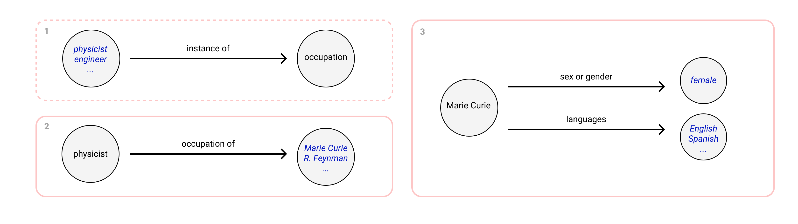

# GENOCC
**GENOCC** is a project to extract bilingual or multilingual parallel data from Wikipedia balanced in gender within occupations.

[:warning: Please, note that **documentation for reproducibility** is currently under construction]

### Data Collection

The first step in our pipeline is to extract data from Wikidata along Wikipedia. Mainly, we collect a set of people *(from now on entities)*  with their occupation(s), gender, and Wikipedia links in all available languages. Afterwards, the user can decide which languages are of their interest to adapt the monolingual extraction phase to their needs. 

To make it run, we just have to execute the following command from the `/collection` directory - within the file you can modify the configuration, e.g. the languages from which the tool has to extract data are defined here in `language_list` variable:

```bash
python3 manager.py
```

The output of the data can be find in the following directories:
* `data/json` <--- Information extraction
* `data/monolingual` <--- Entity Biography Scraping
* `data/preprocessing` <--- Preprocessing


The following explains how to taylor and run each part of the project individually.

#### Information Extraction 

1. `collection/information/get_occupations.py`: extracts all the occupations present in Wikidata.
2. `collection/information/get_entities_for_occupations.py`: for each occupation, we gather the data of every entity that works in the related occupation.
3. `collection/information/get_languages.py` & `collection/information/get_gender.py`: for each entity from the previous step, we determine the gender information and related Wikipedia links in all available languages



You can execute the whole **information extraction** step by running: `python3 pipeline.py`.

#### Entity Biography Scraping

We scrape all the monolingual data from the corresponding Wikipedia biography, only for entities with a link for all of the given languages.

#### Preprocessing 

We clean and split sentences, run language detection and remove duplicates.

#### Mining and Alignment
We perform the sentences embeddings of each language independently and compute the candidates sentences between a source and target language on each entity individually. Then, the final data set is obtained from a multilingual alignment.

To obtain the alignments do the following steps:

* Go to `mining/` directory
* Comment merge_into_folder function call in main body (line 31) from `mining.py`
* Run `python3 mining.py` to obtain several folders to run in parallel the following step
* Go to `alignment/` directory
* In laser_script.sh specify:
  * path_occ variable; where previous execution stored the data `data/mining/0...n` 
  * model_dir; where your LASER model is in your server
* Run `sh laser_script.sh` as many times as configurations.
* Go back to `mining/` directory
* Comment split_into_folders function call in main body (line 30) from `mining.py`
* Uncomment merge_into_folder function call in main body (line 31) from `mining.py`
* Run `python3 mining.py` to obtain a merged folder with all the parallel aligned data at `data/alignment`

#### Balancing
[**TODO**]


### Data usecases
All the data is annotated and is ready to be used for evaluation.

**High Resource**: The `data/translations_HR_data.csv` which represents the parallel data of English (en), Spanish (es), Arabic (ar), Russian (ru). 

**Low Resource**: The `data/translations_LR_data.csv` which represents the parallel data of English (en), Swahili (SW).

### Requirements

All steps requires **Python >= 3.6**. One can install all requiremets executing:

```
pip3 install -r requirements.txt
```

